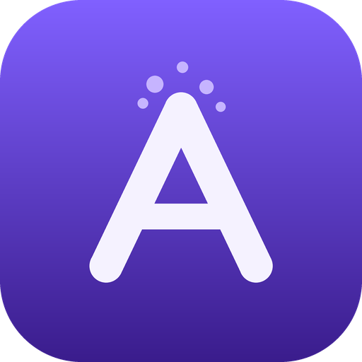

<div align="center">

# Atelier



**A glass cockpit for a personal AI workforce.**

Describe one deliverable in plain words and watch a team of AI helpers research it,
make it, and finish it — on your own Claude subscription, with nothing publishing
or spending until you approve.

</div>

## What it is

Atelier is a Mac desktop app (Electron + a local FastAPI backend). You work on an
infinite canvas of boards. Start from a plain-named **recipe** ("Make a Top-5
video", "Turn my notes into a newsletter") or just type *"make me a ___"*, and an
orchestrator spawns a small team of specialist agents you can watch work live.

It's one product at three depths:

- a shelf of **recipes** and a single *"make me a ___"* box for anyone who never
  wants to see a node,
- a **walk-away workforce** that pings you when something's ready or needs a yes,
- the full agent **canvas** as the backstage power users graduate into.

The recipe a beginner runs *is* the graph a pro reveals — accessibility is the
front door to the same machine, not a dumbed-down mode. It runs entirely on your
**Claude subscription**: zero API keys, zero per-token billing.

**Local UI, cloud model.** The canvas, boards, and files live on your Mac, and the
backend answers only this Mac (loopback, token-gated). The intelligence is a cloud
model: prompts and anything a tool reads for a run (vault notes, workspace files,
web pages) are sent to the model provider you choose — Anthropic on your
subscription, or a provider you connect. The app states this on first launch.

## Highlights

- **Recipe front door** — a gallery of ready-to-run starting points; pick one,
  fill a blank, watch a team build it end to end.
- **In-app render** — produce real vertical videos (neural narration + slides) and
  play them right in the app.
- **Trust, made visible** — a hold-for-approval gate, a live usage + STOP panel, a
  run receipt with provenance, and an autonomy dial (Ask first / Balanced / Autopilot).
- **Walk away** — a "while you were away" digest on reopen, opt-in desktop
  notifications, and a Focus/Calm mode with a wellbeing off-ramp.
- **Publish honestly** — export, plus real posting where it can (webhook, Bluesky)
  and clear "you post it" labels where it can't.
- **Share your work** — turn any board into a re-runnable, shareable **Playbook**.

## Run it

Needs the `claude` CLI logged into your Claude subscription.

```sh
# in .env, leave OPENAI_API_KEY / ANTHROPIC_API_KEY blank:
DEFAULT_MODEL=claude-cli

# desktop app
cd desktop && npm install && npm start
```

The backend (FastAPI) starts automatically with the app.

## License

MIT — see [LICENSE](LICENSE).
